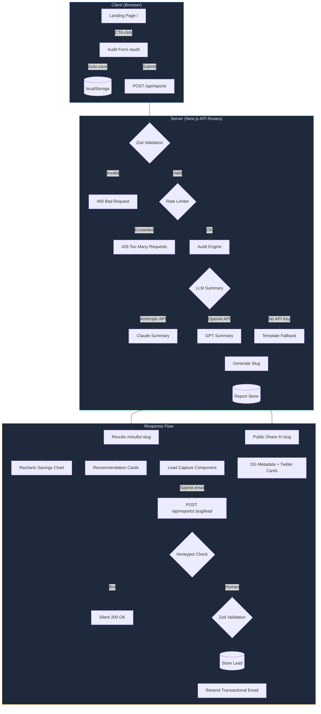

# Architecture

## System Diagram



---

## Data Flow

### Request Lifecycle

1. **Form Input** — User fills in tools, plans, monthly spend, seats, team size, and use case on `/audit`. State is saved locally in `localStorage` (key: `credex-audit-form`) so refreshes do not wipe the work.

2. **Validation** — Client posts the full payload to `POST /api/reports`. Zod validates the request body shape, ensuring all required fields are present with correct types.

3. **Rate Limiting** — In-memory sliding-window rate limiter checks the IP. Allows 8 reports per IP per 60-second window. Returns 429 if exceeded.

4. **Audit Engine** — The rule-based engine (`lib/audit-engine.ts`) runs deterministic analysis across all enabled tools:
   - **Plan-seat mismatch** — Team/Business plans with fewer seats than the plan's minimum trigger a downgrade recommendation
   - **Overspend detection** — Monthly spend 20%+ above list price triggers a realignment notice
   - **Cheaper alternatives** — Cross-vendor comparison for the same use case (gap ≥ $15/month to recommend)
   - **API credit savings** — Usage-based tools get a 20% credit savings suggestion
   - **CTA classification** — Total savings > $500/mo → `credex`, any savings → `notify`, no savings → `healthy`

5. **AI Summary** — The server attempts to generate a personalized narrative using Anthropic (preferred) → OpenAI (fallback) → deterministic template (final fallback). The prompt is constrained to 80–110 words in a CFO-friendly tone.

6. **Persistence** — Reports and leads are stored through Prisma via `lib/report-store.ts`. The local dev database is SQLite, while the schema can be pointed at a managed database for production deployment.

7. **Response** — Client receives the `StoredReport` object and redirects to `/results/[slug]`.

### Lead Capture Flow

1. User views the full report on `/results/[slug]`
2. Email capture form renders _below_ the results (value-first)
3. Honeypot field (`website`) silently catches bots — if filled, returns `200 OK` with no side effects
4. Valid submissions store lead data and trigger a Resend transactional email with the share URL

---

## Key Modules

| Module | Responsibility | Lines | External Deps |
|---|---|---|---|
| `lib/audit-engine.ts` | Rule-based audit logic: plan downgrades, vendor switches, credit routing, list-price realignment | ~200 | None |
| `lib/pricing-data.ts` | Tool definitions, plan tiers, pricing, and lookup helpers for 8 AI tools | ~120 | None |
| `lib/types.ts` | Shared TypeScript types for audit input, results, recommendations, and stored reports | ~85 | None |
| `lib/summary.ts` | LLM summary generation with Anthropic API → OpenAI API → templated fallback chain | ~80 | Native fetch |
| `lib/report-store.ts` | Prisma-backed CRUD for reports and leads | ~70 | @prisma/client |
| `lib/email.ts` | Transactional email via Resend SDK with graceful no-op when unconfigured | ~30 | Resend SDK |
| `lib/rate-limit.ts` | In-memory sliding-window rate limiter keyed by IP | ~25 | None |
| `lib/prisma.ts` | Prisma client singleton (schema defined, ready for migration) | ~15 | @prisma/client |
| `lib/format.ts` | Currency formatting utilities | ~10 | None |

---

## Storage Architecture

### Current (MVP)

```
SQLite via Prisma
├── AuditReport (slug, inputJson, auditJson, summary, savings totals)
└── Lead (email, companyName, role, teamSize, report relation)
```

Prisma-backed store via `lib/report-store.ts`. This gives the app a real relational persistence boundary for reports and leads while keeping local setup simple.

### Target (Production)

```
Supabase Postgres (or any managed Postgres)
├── AuditReport (id, slug, createdAt, teamSize, primaryUseCase, inputJson, auditJson, summary, totalMonthlySavings, totalAnnualSavings)
└── Lead (id, reportId, email, companyName, role, teamSize, createdAt)
```

The same `report-store.ts` interface can be retained for production. Migration path:
1. Switch `prisma/schema.prisma` datasource provider to `postgresql`
2. Update `DATABASE_URL` to a managed Postgres connection string
3. Run `npx prisma migrate deploy`

---

## Security Considerations

| Layer | Mechanism | Details |
|---|---|---|
| **Input validation** | Zod schemas | Every API route validates request body before processing |
| **Rate limiting** | Sliding-window in-memory | 8 reports/IP/min, 5 leads/IP/min |
| **Bot protection** | Honeypot field | `website` field in lead capture — if filled, silently ignored |
| **PII protection** | Server-side stripping | Public share pages at `/r/:slug` exclude company name and email |
| **API key security** | Environment variables | All secrets stored in `.env`, never committed to git |
| **CSRF** | Next.js built-in | App Router API routes use standard Next.js CSRF handling |

---

## Stack Reasoning

| Choice | Why | Alternative Considered |
|---|---|---|
| **Next.js App Router** | Single codebase for marketing, tool, API, metadata, and share pages | Separate frontend + API server (more ops overhead) |
| **TypeScript** | Audit engine rules need explicit types; catches pricing logic errors at compile time | JavaScript (less safety for financial math) |
| **Tailwind CSS v4** | Rapid styling with built-in dark mode and responsive utilities | Vanilla CSS (slower iteration for MVP timeline) |
| **Zod** | Runtime validation that mirrors TypeScript types | Joi, Yup (Zod is lighter and more TypeScript-native) |
| **Recharts** | React-native charting, good defaults, small bundle | Chart.js (less React-idiomatic), D3 (overkill for MVP) |
| **Vitest** | Fast, ESM-native, compatible with TypeScript without config | Jest (slower, needs more config for ESM) |
| **Prisma + SQLite locally** | Real relational persistence with low setup friction | Supabase from day 1 (adds external dependency before validation) |
| **Resend** | Simple API, good DX, generous free tier | SendGrid (more complex setup), Postmark (similar but less modern DX) |

---

## What I'd Change At 10k Audits/Day

1. **Persistence** — Move from local SQLite to managed Postgres using the existing Prisma storage boundary. Add connection pooling via PgBouncer or Supabase's built-in pooler.

2. **Rate Limiting** — Replace in-memory limiter with Upstash Redis or a database-backed solution. Add per-user (not just per-IP) limits for authenticated users.

3. **AI Summary** — Queue summary generation asynchronously via a job system (Inngest, Trigger.dev, or BullMQ). Serve the report immediately and backfill the AI summary via WebSocket or polling.

4. **Caching** — Cache public report reads behind Vercel's edge CDN. Set `Cache-Control` headers for `/r/:slug` pages. Use ISR for the landing page.

5. **Audit Engine** — Separate into a versioned service layer. Pricing updates and logic changes get version-tagged so existing reports can be regenerated with migration-aware logic.

6. **Observability** — Add structured logging (Axiom or Logtail), error tracking (Sentry), and business event analytics (PostHog or Mixpanel).

7. **Multi-tenancy** — Add workspace-level isolation if Credex wants to white-label the audit tool for partners.
