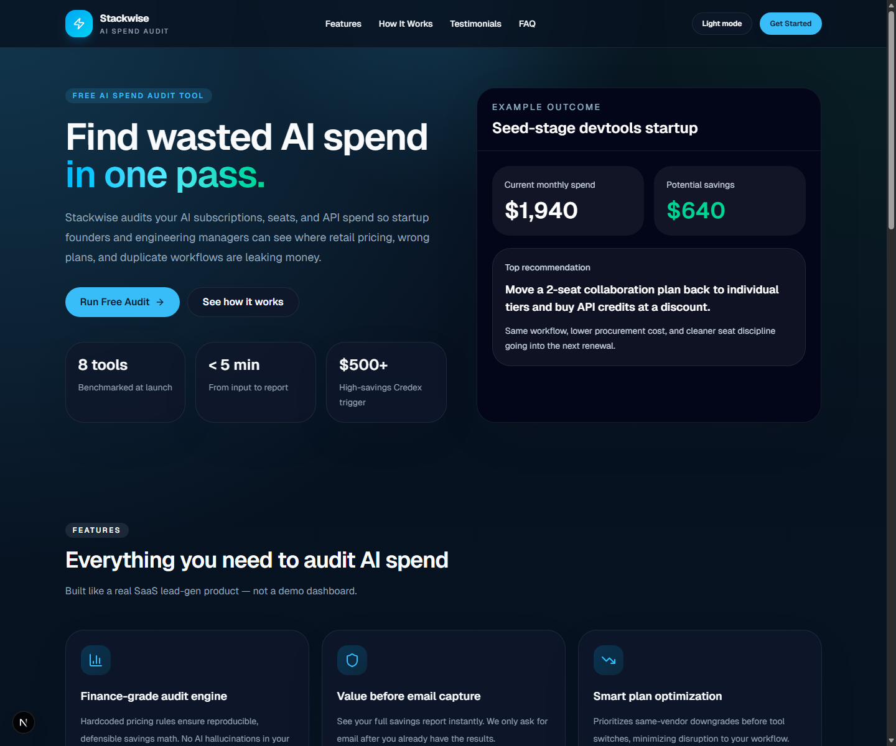
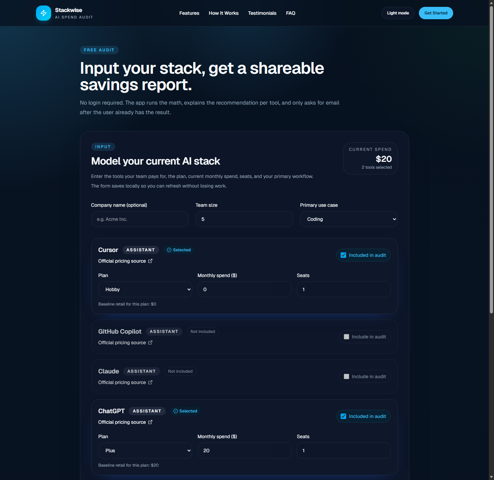
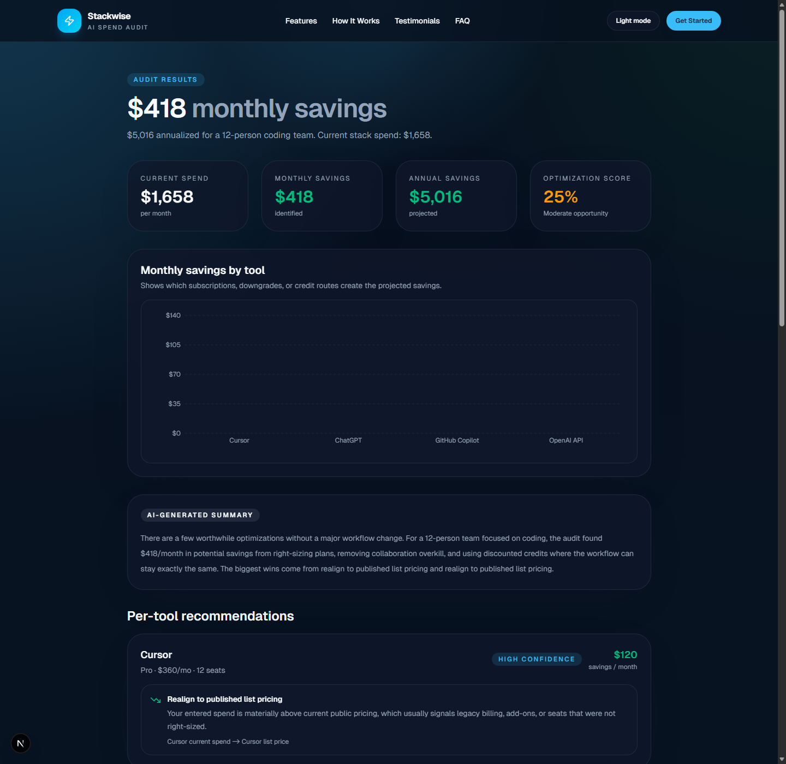
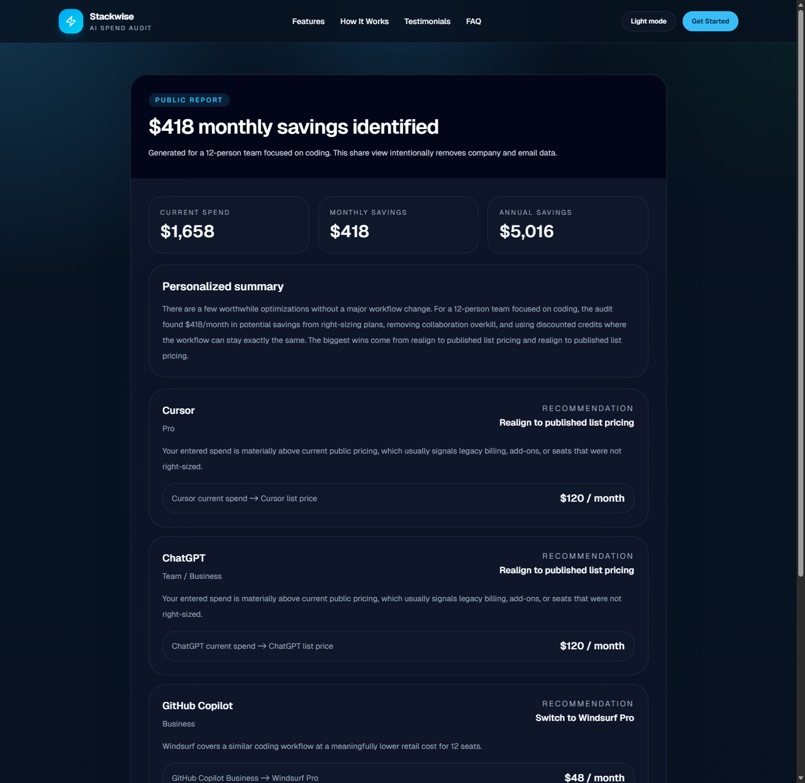

# Stackwise

> **Find wasted AI spend in one pass.**

Stackwise is a Credex-style AI spend audit tool built for startup founders, engineering managers, and finance leads who want a fast, defensible read on where AI subscriptions and API usage are leaking money. Enter your tools, plans, seats, and spend — get an instant savings report, a public share URL, and a post-value email capture flow.

---

## 🌐 Live Demo

Deployment URL: https://ai-spend-audit-iota.vercel.app

Walkthrough evidence is included below as screenshots of the core assignment flow.

---

## 📸 Screenshots

Captured from the live Vercel deployment.

### Landing Page



### Audit Form



### Results Dashboard



### Public Share Page



---

## ✨ Features

| Feature | Description |
|---|---|
| **8 AI tools benchmarked** | Cursor, GitHub Copilot, Claude, ChatGPT, Anthropic API, OpenAI API, Gemini, Windsurf — all with verified pricing |
| **Rule-based audit engine** | Deterministic pricing rules for reproducible, defensible savings math — no AI hallucinations in the numbers |
| **Instant results** | Per-tool recommendations, savings breakdown, confidence levels, and AI-generated narrative summary |
| **Shareable reports** | Public URLs with stripped PII, Open Graph metadata, and Twitter cards for viral sharing |
| **Post-value lead capture** | Email gate comes _after_ the user already has the full report — value-first conversion |
| **Transactional email** | Resend integration for automated follow-up emails with report links |
| **Dark mode** | System-aware theme toggle with `localStorage` persistence |
| **Mobile responsive** | Hamburger menu, fluid layouts, and touch-friendly interactions throughout |
| **Rate limiting** | In-memory sliding-window limiter + honeypot field for bot protection |
| **7 unit tests** | Vitest suite covering all audit engine paths: downgrades, overspend, alternatives, credits, and CTA thresholds |
| **GitHub Actions CI** | Automated lint + test on every push and pull request |
| **Supabase/Prisma storage** | Supabase REST is used when production env vars are present; Prisma SQLite supports local development |

---

## 🏗 Architecture

See [ARCHITECTURE.md](./ARCHITECTURE.md) for the full system diagram, data flow, module reference, and scaling strategy.

### High-Level Flow

```
Landing (/) → Audit Form (/audit) → POST /api/reports → Audit Engine → Results (/results/:slug)
                                                                            ↓
                                                              Public Share (/r/:slug)
                                                                            ↓
                                                              Lead Capture → Email via Resend
```

### Key Design Decisions

| Decision | Rationale |
|---|---|
| **Next.js App Router** | Single codebase for marketing, interactive tool, API, dynamic metadata, and shareable pages |
| **Rule-based audit engine** | Pricing math is reproducible and defensible — unlike AI-generated calculations |
| **Value-first conversion** | Email capture comes after the report renders; assignment explicitly values this pattern |
| **Honeypot + rate limiting** | Cheap, clear, and sufficient for MVP-stage abuse protection |
| **PII-stripped share pages** | Public reports remove company and email data for safe viral sharing |
| **Backend-backed reports** | Supabase is the production persistence target, with a Prisma SQLite path for local development |

---

## 🛠 Tech Stack

| Layer | Technology | Why |
|---|---|---|
| Framework | Next.js 15 (App Router) | SSR, API routes, dynamic metadata in one deploy |
| Language | TypeScript | Type safety for audit engine rules and API contracts |
| Styling | Tailwind CSS v4 | Rapid, consistent UI with dark mode support |
| Charts | Recharts | React-native charting for savings visualizations |
| Icons | Lucide React | Consistent, tree-shakeable icon library |
| Validation | Zod | Runtime schema validation for API inputs |
| AI Summary | Anthropic API / OpenAI | LLM-powered narrative with deterministic fallback |
| Email | Resend | Transactional email for lead follow-up |
| ORM | Prisma | Type-safe database access with migration support |
| Testing | Vitest | Fast, ESM-native test runner |
| CI/CD | GitHub Actions | Automated lint + test on push/PR |
| Deployment | Vercel | Zero-config Next.js hosting with edge functions |

---

## 🚀 Local Setup

### Prerequisites

- Node.js 18+ and npm
- Git

### Installation

```bash
# 1. Clone the repository
git clone <your-public-github-repo-url>
cd ai-spend-audit

# 2. Install dependencies
npm install

# 3. Configure environment variables
copy .env.example .env
# Edit .env and add your API keys (all optional — the app falls back gracefully)

# 4. Generate Prisma client and initialize the local SQLite database
npx prisma generate
npm run db:init

# 5. Start the development server
npm run dev
```

Open [http://localhost:3000](http://localhost:3000) to see the app.

### Build for Production

```bash
npm run build
npm run start
```

---

## 🔐 Environment Variables

| Variable | Required | Default | Description |
|---|:---:|---|---|
| `DATABASE_URL` | No | `file:./dev.db` | Database connection string for Prisma SQLite dev storage |
| `SUPABASE_URL` | Production | — | Supabase project URL for production report/lead storage |
| `SUPABASE_SERVICE_ROLE_KEY` | Production | — | Supabase service role key used only on server routes |
| `ANTHROPIC_API_KEY` | No | — | Anthropic API key for AI-powered report summaries |
| `OPENAI_API_KEY` | No | — | OpenAI API key (fallback if Anthropic unavailable) |
| `RESEND_API_KEY` | Production | — | Resend API key for transactional emails |
| `RESEND_FROM_EMAIL` | Production | `audit@yourdomain.com` | Sender email address for outbound emails |
| `NEXT_PUBLIC_APP_URL` | No | `http://localhost:3000` | Public URL used for share links and OG metadata |

> **Note:** Local development uses Prisma + SQLite. For deployment, create the Supabase tables from `prisma/supabase.sql` and set `SUPABASE_URL` plus `SUPABASE_SERVICE_ROLE_KEY` so reports and leads persist in a managed backend.

### Production Backend Setup

Run `prisma/supabase.sql` in the Supabase SQL editor, then set these Vercel production environment variables before redeploying:

```bash
vercel env add SUPABASE_URL production
vercel env add SUPABASE_SERVICE_ROLE_KEY production
vercel env add RESEND_API_KEY production
vercel env add RESEND_FROM_EMAIL production
vercel env add NEXT_PUBLIC_APP_URL production
vercel --prod
```

---

## 📁 Folder Structure

```
ai-spend-audit/
├── app/
│   ├── page.tsx                        # Landing page (hero, features, FAQ, CTA)
│   ├── layout.tsx                      # Root layout with theme + metadata
│   ├── globals.css                     # Global styles and Tailwind config
│   ├── audit/page.tsx                  # Interactive audit form
│   ├── results/[id]/page.tsx           # Results dashboard with charts + lead capture
│   ├── r/[slug]/page.tsx               # Public share page (PII-stripped)
│   └── api/
│       └── reports/
│           ├── route.ts                # POST — create audit report
│           └── [slug]/lead/route.ts    # POST — capture lead for a report
├── components/
│   ├── spend-audit-form.tsx            # Multi-tool audit input form
│   ├── results-view.tsx                # Results dashboard component
│   ├── lead-capture.tsx                # Post-value email capture
│   ├── public-report.tsx               # Public share report view
│   ├── charts/                         # Recharts visualizations
│   ├── landing/                        # FAQ accordion, hero sections
│   ├── layout/                         # Header, footer, navigation
│   ├── theme/                          # Dark mode toggle
│   └── ui/                             # Badge, Button, Card primitives
├── lib/
│   ├── audit-engine.ts                 # Core rule-based audit logic
│   ├── pricing-data.ts                 # 8 tools × verified plan pricing
│   ├── types.ts                        # Shared TypeScript type definitions
│   ├── summary.ts                      # LLM summary (Anthropic → OpenAI → template)
│   ├── report-store.ts                 # Report + lead persistence layer
│   ├── email.ts                        # Resend email integration
│   ├── rate-limit.ts                   # In-memory sliding-window rate limiter
│   ├── prisma.ts                       # Prisma client singleton
│   └── format.ts                       # Currency formatting utilities
├── prisma/
│   └── schema.prisma                   # AuditReport + Lead models
├── tests/
│   └── audit-engine.test.ts            # 7 Vitest test cases
├── .github/                            # GitHub Actions CI workflow
├── .env.example                        # Environment variable template
├── package.json                        # Dependencies and scripts
├── tsconfig.json                       # TypeScript configuration
├── vitest.config.ts                    # Test runner configuration
```

---

## 📊 Testing

```bash
npm run test              # Run all 7 tests
npm run test -- --coverage    # Run with coverage report
```

7 test cases covering every audit engine path — see [TESTS.md](./TESTS.md) for the exact list.

---

## ⚖️ Tradeoffs

| Decision | Tradeoff | Migration Path |
|---|---|---|
| Prisma + SQLite storage | Real relational storage locally, but not horizontally scalable | Move Prisma datasource to managed Postgres |
| In-memory rate limiting | Fast and zero-dependency, but resets on restart | Swap to Upstash Redis for production |
| No authentication | Reduces audit flow friction, but anyone can generate reports | Add optional OAuth for saved history |
| Templated AI fallback | Users always get a summary, but it's less personalized | Ensure API keys are set in production |
| Static pricing data | Easy to test and defend, but requires manual updates | Add admin panel or pricing API integration |

---

## 🔮 Future Improvements

- **Benchmark mode** — AI spend per developer, spend as % of engineering payroll, stage-based comparisons
- **PDF export** — Downloadable reports for procurement and finance stakeholders
- **Event analytics** — Instrument audit starts, completions, shares, and lead conversions
- **Embeddable widget** — Lightweight audit calculator for blogs and community distribution
- **Async job processing** — Queue AI summary generation for better response times at scale
- **Multi-currency support** — Localized pricing for international teams
- **Admin dashboard** — View leads, conversion funnel, and report analytics

---

## 📄 Documentation

| Document | Purpose |
|---|---|
| [README.md](./README.md) | Project overview, setup, and quick reference |
| [ARCHITECTURE.md](./ARCHITECTURE.md) | System diagram, data flow, stack decisions, scaling strategy |
| [DEVLOG.md](./DEVLOG.md) | Daily progress log with hours, learnings, and blockers |
| [REFLECTION.md](./REFLECTION.md) | Hardest bug, reversed decisions, AI usage, self-rating |
| [ECONOMICS.md](./ECONOMICS.md) | Unit economics and CAC analysis |
| [GTM.md](./GTM.md) | Go-to-market strategy and first 100 users plan |
| [METRICS.md](./METRICS.md) | North star metric and instrumentation plan |
| [PRICING_DATA.md](./PRICING_DATA.md) | Verified pricing sources for all 8 tools |
| [PROMPTS.md](./PROMPTS.md) | LLM prompt design and iteration notes |
| [USER_INTERVIEWS.md](./USER_INTERVIEWS.md) | Real user interview transcripts |

---

## 👤 Author

Built as a Credex take-home assignment.

---

## 📝 License

MIT
